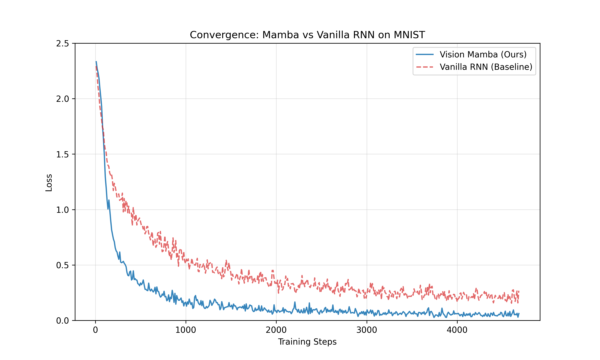
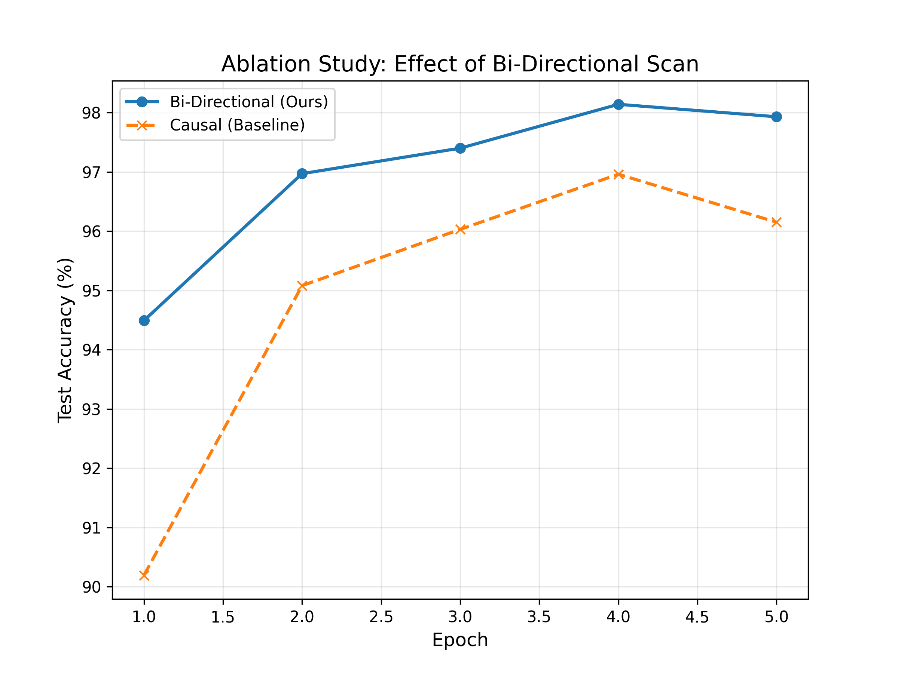
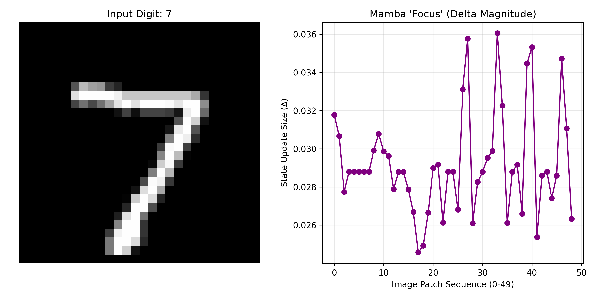

# From Sequence to Spatial: Mamba S6 From Scratch

This repository is a **simple PyTorch reimplementation of Mamba (Selective State Space Models)**, with an extension to **image data**.

The goal is twofold:
1. **Understand Mamba clearly** by implementing the Selective Scan (S6) from scratch in pure PyTorch.
2. **Adapt Mamba to images**, where a strictly causal scan is not sufficient.

No custom CUDA kernels are used.

---

## 🚀 What This Project Does

* **Selective Scan (S6)**  
  A clean and readable implementation of the S6 algorithm using `torch.jit.script`.

* **Vision Mamba (Bi-Directional)**  
  A simple idea: scan the image **forward and backward**, then fuse both passes so every pixel can use information from all spatial directions.

* **Experimental Validation**  
  Experiments on MNIST and TinyShakespeare show faster training and better accuracy compared to standard RNNs and causal Mamba.

---

## 📊 Experiments & Results

### 1. Faster Training than RNNs

We compare Vision Mamba to a vanilla RNN on pixel-sequence classification.  
Mamba converges **faster** and reaches a **lower loss**.



---

### 2. Why Bi-Directionality Matters

A causal scan limits each pixel to only earlier pixels in the scan order.  
Scanning **both directions** removes this limitation.

**Test accuracy:**

| Model | Accuracy |
|---|---|
| Vanilla RNN | 94.40% |
| Causal Mamba | 97.00% |
| **Bi-Directional Vision Mamba (ours)** | **97.93%** |



---

### 3. What the Model Pays Attention To

Mamba uses an input-dependent parameter $\Delta$ that controls how much information is kept.

When visualized on a digit **7**, $\Delta$ becomes large on strokes and edges, and small elsewhere.

This shows that the model **selects information only when needed**.



---

## 📂 Project Structure

```text
.
├── mamba_ssm/              # Core Selective Scan and Mamba blocks
│   ├── s6.py               # S6 implementation (JIT compiled)
│   └── block.py            # Mamba block
├── vision/                 # Vision-specific code
│   └── model.py            # Bi-Directional Vision Mamba
├── scripts/                # Plotting and visualization
├── outputs/                # Figures and logs
├── train_mnist.py          # Bi-Directional training
├── train_mnist_causal.py   # Causal ablation
├── train_rnn_baseline.py   # RNN baseline
└── train_shakespeare.py    # Language modeling
